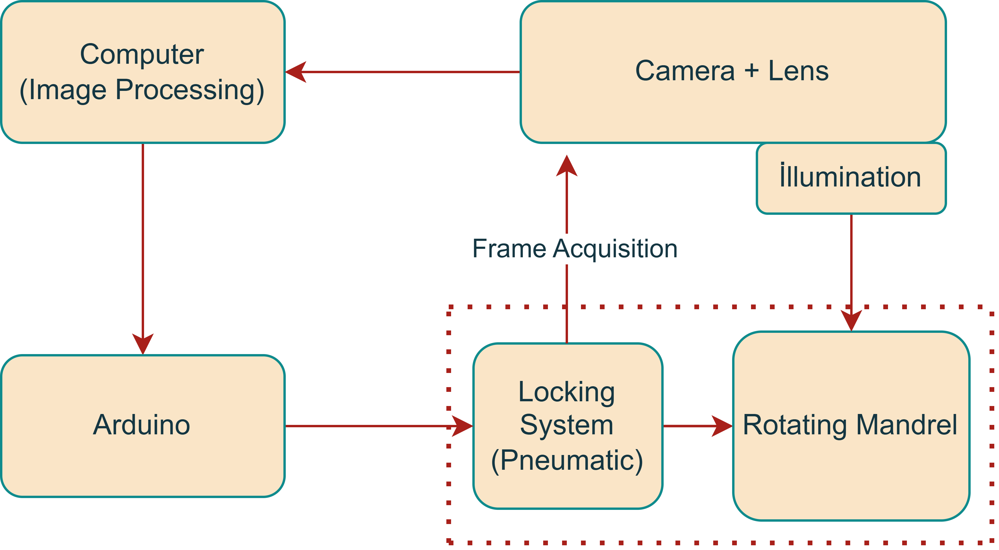
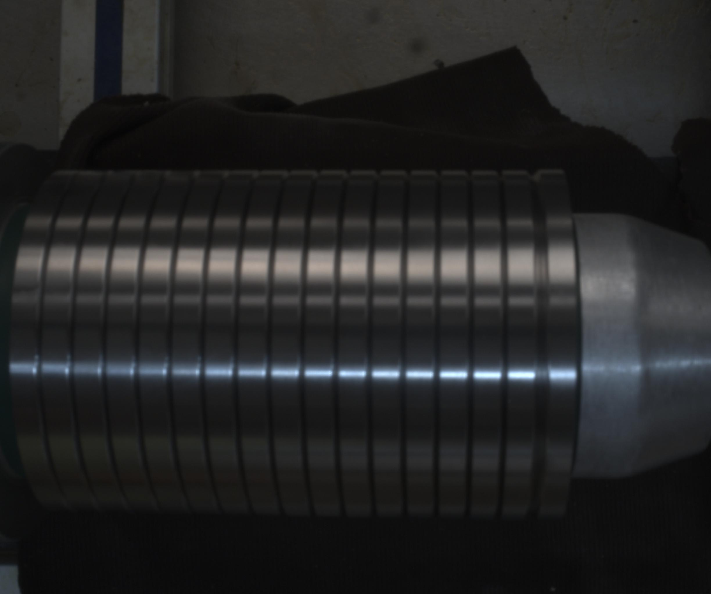
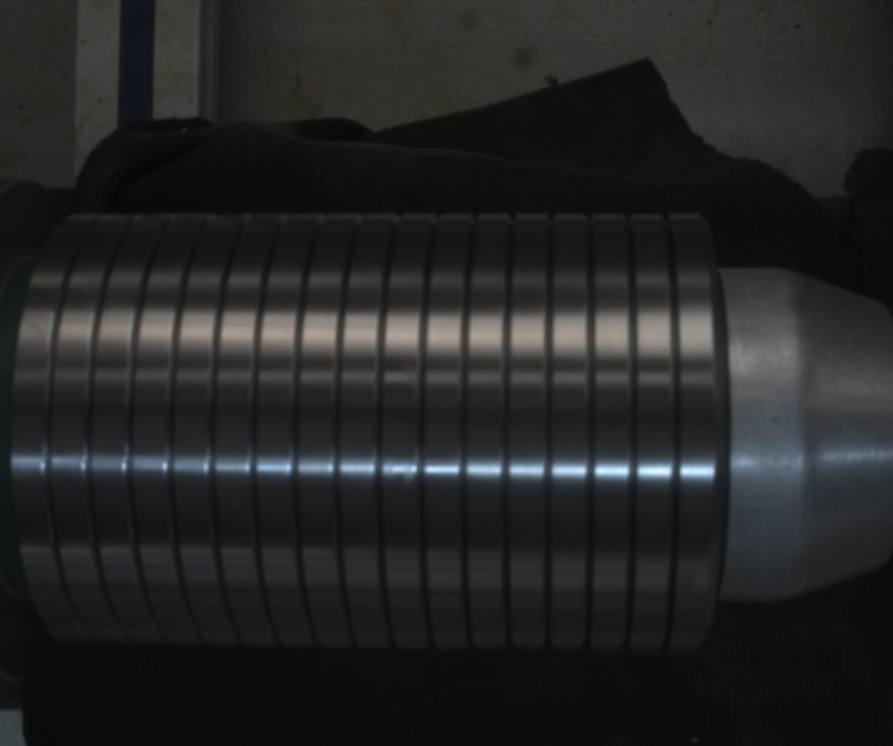
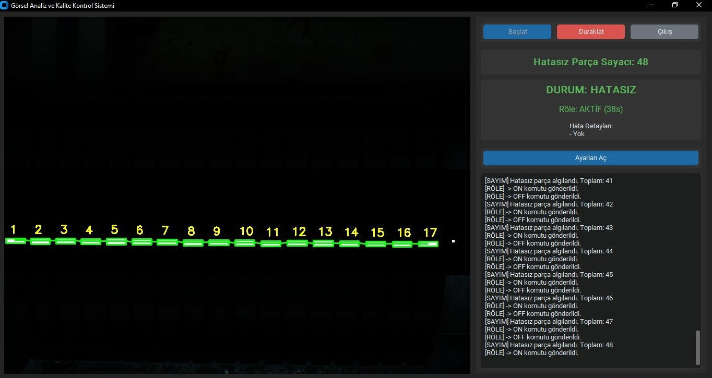
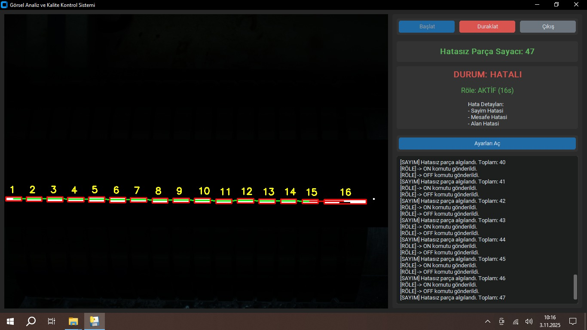

# 🧠 Automated Visual Inspection System

This project is a **comprehensive automated visual inspection system** designed for **industrial environments**.

It is intended for use in the **packaging of industrial parts**, where a mandrel places components into packages.  
Using advanced **image processing algorithms**, the system detects conditions such as **defective, missing, or incorrectly placed parts**.  
When an abnormal condition is detected, the system communicates with the **Arduino-controlled pneumatic mechanism** attached to the mandrel to **lock the system and halt the packaging process**, while simultaneously **notifying the operator** about the detected issue.
It leverages the power of **Python**, **OpenCV** for image processing, and a modern **CustomTkinter GUI** to provide a seamless real-time inspection experience.

---

## 🚀 Overview

The system captures real-time video from an **industrial camera** and automatically analyzes **manufactured parts** to detect potential **defects or irregularities**.

Its modular structure makes it adaptable to different camera models, production lines, and inspection standards.

### ✨ Key Features
- Real-time defect detection using **OpenCV**
- Interactive and responsive **CustomTkinter GUI**
- Integration with **Baumer industrial cameras**
- Adjustable **ROI (Region of Interest)** and **threshold settings**
- High performance with **multithreading** support
- Easy deployment as a **standalone executable (.exe)**

---

## 🖥️ System Architecture

---------------
⚙️ Prerequisites

Before running the project, make sure you have installed the following:

1️⃣ Baumer neoapi GAPI SDKs

The system cannot establish a connection with the camera without the SDKs installed.
You can download them from the official Baumer website:
🔗 https://www.baumer.com/

Once installed, confirm your camera is detected in Baumer Camera Explorer (you can also update your camera software with Baumer Camera Explorer).

---------------

🎥 Camera Configuration

Your camera ID is physically printed on the device label.

Example ID:2825000092AD

If you cannot find it, open Baumer Camera Explorer and check the connected camera list.

⚠️ Important:
Use the ID that starts with U3V, not the one labeled S/N.

--------------

🧱 Building an Executable (.exe)

You can past the code to terminal above or in createExe.py

'python -m PyInstaller --noconsole --name "YourApplicationName" your_script_name.py'

Building is going start automatically in your source file.

after building you may notice that certain NeoAPI dependencies in dist/application_name/_internal/neoapi/  such as: xxx.dll, xxx.cti  were not automatically included in the build. 

To fix this:

go to **C:\Program Files\Baumer Camera Explorer** . Find the **bgapi2** files like bgapi2_genicam.dll .

Then, manually copy them into: **dist/application_name/_internal/neoapi/**

----

## 📘 User Guide (GUI Usage)

After building the project, launch the **desktop application**.

### 🟢 Step 1: Starting the System
On the first screen, click **“Sistemi Başlat”** (which means **Start the System**).  
This will initialize the main process and prepare the visual inspection workflow.

### 🟢 Step 2: Running the Main Interface
After that, click **“Başlat”** (meaning **Start**) on the next screen.  
At the bottom-left terminal area, make sure you can see both of these status messages:
- **Arduino’ya bağlandı** → *Connected to Arduino*  
- **Kameraya bağlandı** → *Connected to Camera*  

Once both connections are established, the system is **ready for operation**.

### ⚙️ Step 3: Adjusting Settings
From the right panel, click **“Ayarları Aç”** (meaning **Open Settings**).  
After entering your password, you can configure:
- **Distance** parameters  
- **Part count** (how many pieces should be detected/assembled)  
- **Relay activation time** (how long the pneumatic system stays active)

When you’re done, click **“Ayarları Kitle”** (meaning **Lock Settings**) to **save and apply your configurations**.

---

✅ After completing these steps, your automated visual inspection system will be **fully operational and ready for continuous inspection.**

⚡ Performance Tips

If you notice lagging or freezing, it’s likely related to:

High **camera resolution**

Inefficient **window scaling**

Low system resources (CPU/GPU)

✅ You can modify these parameters directly in the code:

Frame size and FPS inside 'main.py'

GUI refresh interval inside VisionController 'class'

---
🖼️ Example GUI Screenshots and Parts

**Defective part**

**Original Part**

**Main Interface**

**Defect Detection View**

Detected defective regions are automatically highlighted in red.

---
👨‍💻 Author

Berkant Akıncı

